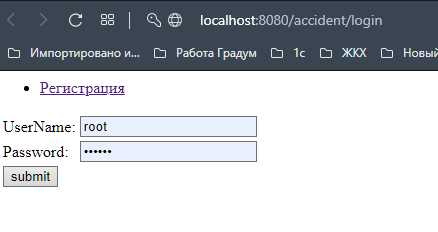
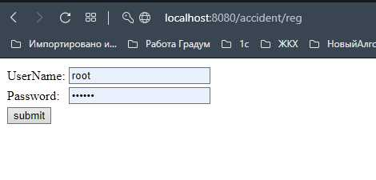
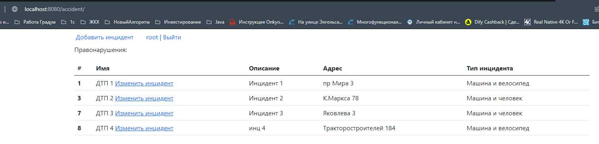
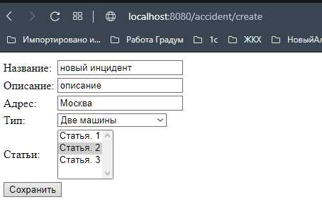

Car_accident
====================================================
Project: Car accidents.
----------------------------------------------------
Account registration is available. After registration, it is possible
to save and edit accidents. Accidents consist of "Название", "Описание",
"Адрес", "Тип", "Статья". On the main page there is a list of all accidents.
The project uses Spring MVC, Spring security, Hibernate.

Configuration
----------------------------------------------------
The project should be configured the Spring MVC, Tomcat.

Usage
----------------------------------------------------
